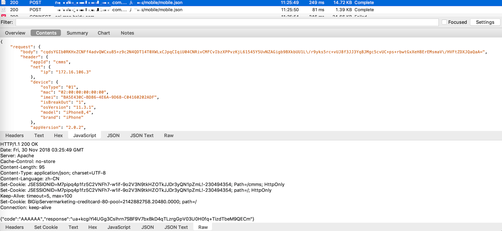
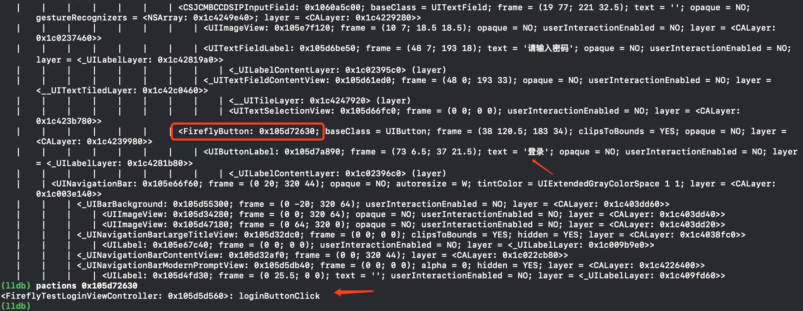
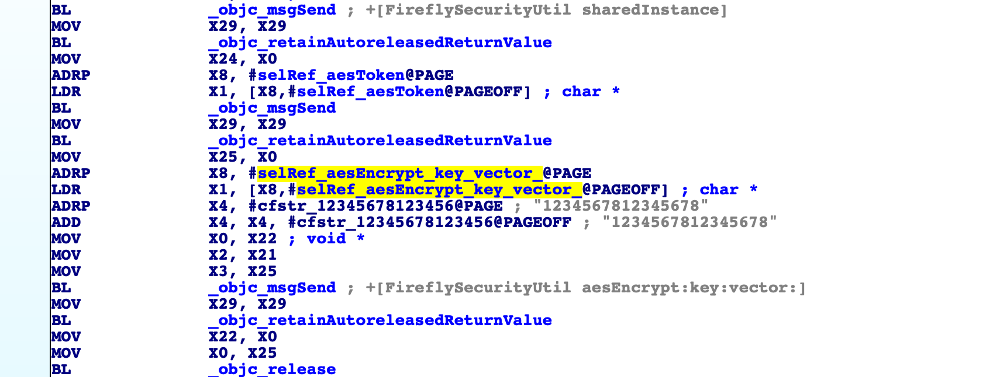

## FridaDev

作为大自然的搬运工和组装师傅，收集并增强一些非常有用的frida脚本封装为FridaDev工具，可以实现一键式逆向需求，提高生产力。

脚本来源：

* [https://github.com/0xdea/frida-scripts](https://github.com/0xdea/frida-scripts)
* [https://github.com/AloneMonkey/iOSREBook/tree/master/chapter-7/7.3%20Frida%E5%AE%9E%E6%88%98%E5%BA%94%E7%94%A8/Frida](https://github.com/AloneMonkey/iOSREBook/tree/master/chapter-7/7.3%20Frida%E5%AE%9E%E6%88%98%E5%BA%94%E7%94%A8/Frida)

修改：

* 动态hook
* ui增加打印controller和action
* 根据稳定性trace选择spwan，其他功能选择attach

### 功能

```text
usage: fridaDev.py [-h] [-l] [-i] [-u appName] [-d appName] [-t identifier]
                   [-e identifier]

frida tools

optional arguments:
  -h, --help            show this help message and exit
  -l, --list            list running processes
  -i, --info            list installed app infomation
  -u appName, --ui appName
                        show UI (only for ios)
  -d appName, --dynhook appName
                        dynamic hook
  -t identifier, --trace identifier
                        ObjC/java and Module tracer
  -e identifier, --enumerate identifier
                        Collection of functions to enumerate classes and
```

#### list
功能：列出运行进程名及pid

使用（支持grep）：./fridaDev.py -l (| grep xxx)

```
[*] Device info: Device(id="83ae210b1d153c611e268b45b54e5f77d575212b", name="iPhone", type='usb')

pid   	name
0     	launchd
1     	launchd
179   	amfid
346   	jailbreakd
491   	wifid
...
```

#### info
功能：列出已装应用的应用名、bundleId及沙盒路径

使用（支持grep）：./fridaDev.py -i (| grep xxx)

```
[*] Device info: Device(id="83ae210b1d153c611e268b45b54e5f77d575212b", name="iPhone", type='usb')

app name                                	bundle identify                                             	documents path
undefinedQQ浏览器                          	com.tencent.mttlite                                         	file:///private/var/mobile/Containers/Data/Application/0F2137C5-52EC-4C44-9247-9D1E2666AE0C/Documents
计算器                                     	com.apple.calculator                                        	file:///private/var/mobile/Containers/Data/Application/4A593BCE-1460-4785-BC18-18DFAF5BFFBA/Documents
通讯录                                     	com.apple.MobileAddressBook                                 	file:///private/var/mobile/Containers/Data/Application/F8C2EB38-1FBE-415B-B562-C910589F66FE/Documents
咪咕善跑                                    	org.imohoo.shanpao                                          	file:///private/var/mobile/Containers/Data/Application/0FC0A9BF-958C-4BCD-9AF0-5680B414A853/Documents
```

#### ui（仅支持iOS）

功能：dump iOS界面布局，支持打印nextResponder、controller及action

使用：

1. 打开需要dump的应用界面
2. ./fridaDev.py -u appName
	* 打印响应链nextResponder： n 0x144f6e6c0
	* 打印controller： c 0x144f6e6c0
	* 打印action： a 0x144f6e6c0

```c++
[*] Device info: Device(id="83ae210b1d153c611e268b45b54e5f77d575212b", name="iPhone", type='usb')

<UIWindow: 0x146007e40; frame = (0 0; 320 480); gestureRecognizers = <NSArray: 0x146009290>; layer = <UIWindowLayer: 0x146007dc0>>
   | <UILayoutContainerView: 0x144d629d0; frame = (0 0; 320 480); autoresize = W+H; gestureRecognizers = <NSArray: 0x14602c450>; layer = <CALayer: 0x144d63ac0>>
   |    | <UINavigationTransitionView: 0x146026be0; frame = (0 0; 320 480); clipsToBounds = YES; autoresize = W+H; layer = <CALayer: 0x146023cf0>>
   |    |    | <UIViewControllerWrapperView: 0x144f6fd50; frame = (0 0; 320 480); autoresize = W+H; layer = <CALayer: 0x144f6f2e0>>

...

   |    |    |    |    |    |    | <FireflyButton: 0x144f6e6c0; baseClass = UIButton; frame = (38 120.5; 183 34); clipsToBounds = YES; opaque = NO; layer = <CALayer: 0x144f6d690>>
   |    |    |    |    |    |    |    | <UIButtonLabel: 0x1460665c0; frame = (73.5 6.5; 36 21.5); text = '登录'; opaque = NO; userInteractionEnabled = NO; layer = <_UILabelLayer: 0x1460667e0>>
   |    |    |    |    |    |    |    |    | <_UILabelContentLayer: 0x144f67e20> (layer)
   |    | <UINavigationBar: 0x144da8880; frame = (0 20; 320 44); opaque = NO; autoresize = W; tintColor = UIDeviceWhiteColorSpace 1 1; gestureRecognizers = <NSArray: 0x14602ddd0>; layer = <CALayer: 0x1460279d0>>
   |    |    | <_UINavigationBarBackground: 0x146026f60; frame = (0 -20; 320 64); opaque = NO; autoresize = W; userInteractionEnabled = NO; layer = <CALayer: 0x14602b8b0>>
   |    |    |    | <UIImageView: 0x144db8f10; frame = (0 64; 320 0); opaque = NO; userInteractionEnabled = NO; layer = <CALayer: 0x146023e00>>
   |    |    | <_UINavigationBarBackIndicatorView: 0x14602cab0; frame = (8 11.5; 13 21); alpha = 0; opaque = NO; userInteractionEnabled = NO; layer = <CALayer: 0x144da7510>>
<CSNavJViewController 0x1450fe000>, state: appeared, view: <UILayoutContainerView 0x144d629d0>
   | <FireflyTestLoginViewController 0x144f37c30>, state: appeared, view: <UIView 0x14602d3a0>
a 0x144f6e6c0
-> loginButtonClick
c 0x144f6e6c0
-> <FireflyTestLoginViewController: 0x144f37c30>
n 0x144f6e6c0
-><UIImageView: 0x144f33530; frame = (30.5 145.5; 259 189); alpha = 0.8; opaque = NO; layer = <CALayer: 0x144f03d00>>
--><UIImageView: 0x144f390a0; frame = (0 0; 320 480); opaque = NO; layer = <CALayer: 0x144f24d10>>
---><UIView: 0x14602d3a0; frame = (0 0; 320 480); autoresize = W+H; layer = <CALayer: 0x144d49060>>
----><FireflyTestLoginViewController: 0x144f37c30>
-----><UIViewControllerWrapperView: 0x144f6fd50; frame = (0 0; 320 480); autoresize = W+H; layer = <CALayer: 0x144f6f2e0>>
...

```

#### dynhook

功能：hook对应函数，做你所想

说明：android Hook代码写入`android_hook.js`，iOS Hook代码写入`ios_hook.js`，脚本自行判断平台。

使用：./fridaDev.py -d appName

```
[*] Device info: Device(id="83ae210b1d153c611e268b45b54e5f77d575212b", name="iPhone", type='usb')

[+] killing 36988
[-] xxx is not found...
[+] Injecting script to xxx(37079)
+[FireflySecurityUtil aesEncrypt:key:vector:] onEnter...
+[FireflySecurityUtil aesEncrypt:key:vector:] onLeave...
ret: nil
```

#### trace

功能：追踪函数调用，打印输入输出

说明：android trace修改`android_trace.js`，iOS trace修改`ios_trace.js`，脚本自行判断平台。 **支持正则，可以发挥你的想象力**。

修改如下内容：

```js
// usage examples
if (ObjC.available) {
	trace("-[FireflyTestLoginViewController loginButtonClick]")
	// trace("-[FireflyTestLoginViewController *]")
	trace("*[* *ncrypt*]");
	// trace("exports:libSystem.B.dylib!CCCrypt");
	// trace("exports:libSystem.B.dylib!open");
	// trace("exports:*!open*");
	
} else {
 	send("error: Objective-C Runtime is not available!");
}
```

使用：./fridaDev.py -t bundleId

```
[iPhone::com.lzm.khjlHack]->
*** entered -[FireflyTestLoginViewController viewDidLoad]

Caller: 0x1840de580 CoreFoundation!__invoking___

*** entered -[FireflyTestLoginViewController setIsBool:]

Caller: 0x1840de580 CoreFoundation!__invoking___

setIsBool: nil

retval: <FireflyTestLoginViewController: 0x12de4a180>

*** exiting -[FireflyTestLoginViewController setIsBool:]

*** entered -[FireflyTestLoginViewController initViews]

Caller: 0x1840de580 CoreFoundation!__invoking___

*** entered -[FireflyTestLoginViewController BackIamgeViewUI]

Caller: 0x1840de580 CoreFoundation!__invoking___

retval: <UIView: 0x12de3b400; frame = (0 0; 320 480); autoresize = W+H; layer = <CALayer: 0x1c02292a0>>

*** exiting -[FireflyTestLoginViewController BackIamgeViewUI]

...
```

#### enumerate

功能：枚举所有类、所有方法、一个类的所有方法、匹配正则的所有类、匹配正则的所有方法

说明：android enumerate修改`android_enum.js`，iOS enumerate修改`ios_enum.js`，脚本自行判断平台。 **支持正则，可以发挥你的想象力**。

修改如下内容：

```js
// usage examples
if (ObjC.available) {

	// enumerate all classes
	/*
	var a = enumAllClasses();
	a.forEach(function(s) { 
		console.log(s); 
	});
	*/

	// find classes that match a pattern
	/*
	var a = findClasses(/FireflySecurityUtil/i);
	a.forEach(function(s) { 
		console.log(s); 
	});
	*/

	// enumerate all methods in a class
	/*
	var a = enumMethods("CGBLoginViewController")
	a.forEach(function(s) { 
		console.log(s); 
	});
	*/

	// enumerate all methods
	/*
	var d = enumAllMethods();
	for (k in d) {
		console.log(k);
		d[k].forEach(function(s) {
			console.log("\t" + s);
		});
	}
	*/

	// find methods that match a pattern
	
	var d = findMethods(/encrypt|decrypt/i);
	for (k in d) {
		console.log(k);
		d[k].forEach(function(s) {
			console.log("\t" + s);
		});
	}
} else {
 	send("error: Objective-C Runtime is not available!");
}
```

使用：./fridaDev.py -e bundleId

```
[*] Device info: Device(id="83ae210b1d153c611e268b45b54e5f77d575212b", name="iPhone", type='usb')

CMBCStandardiOSSipKeyboardVC
	- setNeedEncrypt:
	- getEncryptedDataWithError:
	- needEncrypt
	- initWithKeyboardType:needEncrypt:
FireflySecurityUtil
	+ qhd_FireflyRSAEncrypt:cerPath:
	+ qhd_FireflyRSAEncrypt:publicKey:
	+ qhd_aesDecrypt:key:vector:
	+ qhd_aesEncrypt:key:vector:
	+ aesEncrypt:key:vector:
	+ aesDecrypt:key:vector:
	+ FireflyRSAEncrypt:publicKey:
	+ FireflyRSAEncrypt:cerPath:
CMCCSafeManager
	- getEncryptCode:
	- decryptCode:
	- getDecryptCode:
	- encryptCode:
	- encryptWithContent:
	- decryptWithContent:
FaceResult
	- encryptRandom
	- setEncryptRandom:

...
```

### 实例

以某app为例介绍工具使用。

登录界面


登录数据包加密


现在需要破解加解密，分两种方式：

1. 猜解加解密关键字定位加解密函数
2. 正向分析登录功能找到加解密逻辑

#### 猜解

猜解的方式存在偶然性，不采用标准库加密或常规加解密命名的就很难找到。

我们尝试使用fridaDev的`--enumerate`功能枚举加解密逻辑，修改`ios_enum.js`中的正则匹配枚举方法处代码，正则中修改为`encrypt|decrypt`.

```js
var d = findMethods(/encrypt|decrypt/i);
for (k in d) {
	console.log(k);
	d[k].forEach(function(s) {
		console.log("\t" + s);
	});
}
```

运行脚本查看输出

```
[*] Device info: Device(id="83ae210b1d153c611e268b45b54e5f77d575212b", name="iPhone", type='usb')

CMBCStandardiOSSipKeyboardVC
    - setNeedEncrypt:
    - getEncryptedDataWithError:
    - needEncrypt
    - initWithKeyboardType:needEncrypt:
FireflySecurityUtil
    + qhd_FireflyRSAEncrypt:cerPath:
    + qhd_FireflyRSAEncrypt:publicKey:
    + qhd_aesDecrypt:key:vector:
    + qhd_aesEncrypt:key:vector:
    + aesEncrypt:key:vector:
    + aesDecrypt:key:vector:
    + FireflyRSAEncrypt:publicKey:
    + FireflyRSAEncrypt:cerPath:
CMCCSafeManager
    - getEncryptCode:
    - decryptCode:
    - getDecryptCode:
    - encryptCode:
    - encryptWithContent:
    - decryptWithContent:
...
```

通过挨个排查或者你dump了界面UI知道view的controller类名，其实已经基本能猜测调用哪些相关加解密函数。

如果你还是不确定哪个类里的那个方法被调用，没关系，我们通过trace功能追踪函数调用来确定具体使用哪个方法。

修改`ios_trace.js`尾部代码：

```js
if (ObjC.available) {
	trace("*[CMBCStandardiOSSipKeyboardVC *]");
	trace("*[FireflySecurityUtil *]");
	trace("*[CMCCSafeManager *]");
} else {
 	send("error: Objective-C Runtime is not available!");
}
```

运行代码后启动应用，点击登录查看此处log：

```
...

*** entered +[FireflySecurityUtil FireflyRSAEncrypt:publicKey:]

Caller: 0x1840de580 CoreFoundation!__invoking___

FireflyRSAEncrypt: {"flag":"0","ckey":"AZWKLXOMREDGAKPMTIBHTKOBRVGKNBHC"}
publicKey: MIGfMA0GCSqGSIb3DQEBAQUAA4GNADCBiQKBgQDFV+0lKbisYcFxEaalfN4DMc14fMVTZTFZB1X4MoZtEu6lFpVvmSZT4eaSgp1Vxol8HSsqFncxxtv/GXpqJ3kY1DghafKliSFfTkV1PYoHKGoUYVdwt/HubzQBcC3xh+xiZvspBWy4Bjal//HoHrBBN05R2ZFnU9obS4Xw+jKbOQIDAQAB

*** entered +[FireflySecurityUtil stripPublicKeyHeader:]

Caller: 0x1840de580 CoreFoundation!__invoking___

stripPublicKeyHeader: <30819f30 0d06092a 864886f7 0d010101 05000381 8d003081 89028181 00c557ed 2529b8ac 61c17111 a6a57cde 0331cd78 7cc55365 31590755 f832866d 12eea516 956f9926 53e1e692 829d55c6 897c1d2b 2a167731 c6dbff19 7a6a2779 18d43821 69f2a589 215f4e45 753d8a07 286a1461 5770b7f1 ee6f3401 702df187 ec6266fb 29056cb8 0636a5ff f1e81eb0 41374e51 d9916753 da1b4b85 f0fa329b 39020301 0001>

retval: <30818902 818100c5 57ed2529 b8ac61c1 7111a6a5 7cde0331 cd787cc5 53653159 0755f832 866d12ee a516956f 992653e1 e692829d 55c6897c 1d2b2a16 7731c6db ff197a6a 277918d4 382169f2 a589215f 4e45753d 8a07286a 14615770 b7f1ee6f 3401702d f187ec62 66fb2905 6cb80636 a5fff1e8 1eb04137 4e51d991 6753da1b 4b85f0fa 329b3902 03010001>

*** exiting +[FireflySecurityUtil stripPublicKeyHeader:]

retval: NrbG9/JxK65OMfl9WsFmCYU5Xfr1Av6Q/XOulxeoDc5CSf2AajFgE3CSH6MVHD3YlqCq4/Z20PevpakS1LMjsIpiywsOsrrfDESr87ATJ3Ta4TuGfg7ooLwAbUVHh77a4ZJInEaz63cpZuviy5b/fsftGjqllWtqxATNjU3dRBI=

*** exiting +[FireflySecurityUtil FireflyRSAEncrypt:publicKey:]

*** entered +[FireflySecurityUtil isJailBreak]

Caller: 0x1840de580 CoreFoundation!__invoking___

retval: 0x1

*** exiting +[FireflySecurityUtil isJailBreak]

...

*** entered -[FireflySecurityUtil aesToken]

Caller: 0x1840de580 CoreFoundation!__invoking___

retval: AZWKLXOMREDGAKPM5pblzNXaVqAXmBwl

*** exiting -[FireflySecurityUtil aesToken]

*** entered +[FireflySecurityUtil aesEncrypt:key:vector:]

Caller: 0x1840de580 CoreFoundation!__invoking___

aesEncrypt: {"secRan":"W9zvEM","staffId":"F","password":"NmQk8hKN9Sn1UTQha4JnAxYnfJiUGdwTw+Lws9rWHhsXgBt2ZARjOfrxH3Ka166Wias83OROXYjof6NvZ9zMJaKAP1NBPsiWZEE7gkRDlpCKwR\/AVMwOzA4xAFcb7WKWIWrJg7NjpsvMvsjxzqxx\/2sR4zglTx8P6jpHWigCEf0=","imeiCode":"3823ACEE-A647-46F8-8D14-8065E5C2B0C6","validateImgCode":""}
key: AZWKLXOMREDGAKPM5pblzNXaVqAXmBwl
vector: 1234567812345678

retval: yUF8H3QiqR21mTIrNxTTRtNx4l2IAyJ6AT0r7ATs9vO5MgYCahUT3qRxrT+qWDhyDD2znN5t1esauWYHPt+2AAd4NrfcYVs/QPMOstjpGcp4wey1HssAYNk2OtAKz5lRo6Bnw8CFiKMWdpdBS5Y4/G80irK0Dq12oPc52I956UtP3zCFNqE2rfQFZqcd35FA0CajccT5Ny6v/qKoScApnTLBmTKMmj3na+PTzyIOLXr1ObjwY9C+Snygf4xzb9AEU73WbIjxhsfdG6m3mEGrugw8Gn3nj/Eqb3mREUkvsQMt9FezDd4PWnJTRM6r6D5S5WI7ACYJU8kYDF0VK4H0Ixpe+xNoLdtYabgtcoSd9zkTFADW/SY6JzJaa6BwHpWoBeOree/dRgr6xyA8H4Zphw==

*** exiting +[FireflySecurityUtil aesEncrypt:key:vector:]

...
```

可以看到点击登录后调用`+[FireflySecurityUtil FireflyRSAEncrypt:publicKey:]`对cKey加密，调用`+[FireflySecurityUtil aesEncrypt:key:vector:]`对请求数据进行aes加密，成功定位数据加解密函数。

你甚至可以直接在trace代码中写:

```
trace("*[ *ncrypt*]");
```

同样可以动态定位加密函数。

#### 正向分析

从界面入手找到登录view对应的controller，或者登录button对应的action，可以通过cycript或者lldb方式:



但是我们现在使用fridaDev来确定登录逻辑入口

首先使用fridaDev的ui功能dump页面，通过登录button找到对应action。

```c
[*] Device info: Device(id="33010c846ea011df002c0781f922a10c9f2aca48", name="iPad 4", type='usb')

<UIWindow: 0x146007e40; frame = (0 0; 320 480); gestureRecognizers = <NSArray: 0x146009290>; layer = <UIWindowLayer: 0x146007dc0>>
   | <UILayoutContainerView: 0x144d629d0; frame = (0 0; 320 480); autoresize = W+H; gestureRecognizers = <NSArray: 0x14602c450>; layer = <CALayer: 0x144d63ac0>>
   |    | <UINavigationTransitionView: 0x146026be0; frame = (0 0; 320 480); clipsToBounds = YES; autoresize = W+H; layer = <CALayer: 0x146023cf0>>
   |    |    | <UIViewControllerWrapperView: 0x144f6fd50; frame = (0 0; 320 480); autoresize = W+H; layer = <CALayer: 0x144f6f2e0>>
   |    |    |    | <UIView: 0x14602d3a0; frame = (0 0; 320 480); autoresize = W+H; layer = <CALayer: 0x144d49060>>
   |    |    |    |    | <UIImageView: 0x144f390a0; frame = (0 0; 320 480); opaque = NO; layer = <CALayer: 0x144f24d10>>
   |    |    |    |    |    | <UIImageView: 0x144f33530; frame = (30.5 145.5; 259 189); alpha = 0.8; opaque = NO; layer = <CALayer: 0x144f03d00>>
   |    |    |    |    |    |    | <FireflyUserNameTextFieldView: 0x144f34260; baseClass = UITextField; frame = (19 26; 221 32); text = ''; clipsToBounds = YES; opaque = NO; gestureRecognizers = <NSArray: 0x144f72190>; layer = <CALayer: 0x144f39a50>>
   |    |    |    |    |    |    |    | <UIImageView: 0x146032820; frame = (10 7; 18.5 18.5); opaque = NO; userInteractionEnabled = NO; layer = <CALayer: 0x146032670>>
   |    |    |    |    |    |    |    | <UITextFieldLabel: 0x146033470; frame = (48 0; 193 32); text = '请输入员工号'; opaque = NO; userInteractionEnabled = NO; layer = <_UILabelLayer: 0x146033680>>
   |    |    |    |    |    |    |    |    | <_UILabelContentLayer: 0x14606e1d0> (layer)
   |    |    |    |    |    |    | <CSJCMBCCDSIPInputField: 0x146034e00; baseClass = UITextField; frame = (19 77; 221 32.5); text = ''; clipsToBounds = YES; opaque = NO; gestureRecognizers = <NSArray: 0x144f74e20>; layer = <CALayer: 0x146034460>>
   |    |    |    |    |    |    |    | <UIImageView: 0x144f6bae0; frame = (10 7; 18.5 18.5); opaque = NO; userInteractionEnabled = NO; layer = <CALayer: 0x144f2f1b0>>
   |    |    |    |    |    |    |    | <UITextFieldLabel: 0x144f6d060; frame = (48 0; 193 32); text = '请输入密码'; opaque = NO; userInteractionEnabled = NO; layer = <_UILabelLayer: 0x144f6d270>>
   |    |    |    |    |    |    |    |    | <_UILabelContentLayer: 0x14606f280> (layer)
   |    |    |    |    |    |    | <FireflyButton: 0x144f6e6c0; baseClass = UIButton; frame = (38 120.5; 183 34); clipsToBounds = YES; opaque = NO; layer = <CALayer: 0x144f6d690>>
   |    |    |    |    |    |    |    | <UIButtonLabel: 0x1460665c0; frame = (73.5 6.5; 36 21.5); text = '登录'; opaque = NO; userInteractionEnabled = NO; layer = <_UILabelLayer: 0x1460667e0>>
   |    |    |    |    |    |    |    |    | <_UILabelContentLayer: 0x144f67e20> (layer)
   |    | <UINavigationBar: 0x144da8880; frame = (0 20; 320 44); opaque = NO; autoresize = W; tintColor = UIDeviceWhiteColorSpace 1 1; gestureRecognizers = <NSArray: 0x14602ddd0>; layer = <CALayer: 0x1460279d0>>
   |    |    | <_UINavigationBarBackground: 0x146026f60; frame = (0 -20; 320 64); opaque = NO; autoresize = W; userInteractionEnabled = NO; layer = <CALayer: 0x14602b8b0>>
   |    |    |    | <UIImageView: 0x144db8f10; frame = (0 64; 320 0); opaque = NO; userInteractionEnabled = NO; layer = <CALayer: 0x146023e00>>
   |    |    | <_UINavigationBarBackIndicatorView: 0x14602cab0; frame = (8 11.5; 13 21); alpha = 0; opaque = NO; userInteractionEnabled = NO; layer = <CALayer: 0x144da7510>>
<CSNavJViewController 0x1450fe000>, state: appeared, view: <UILayoutContainerView 0x144d629d0>
   | <FireflyTestLoginViewController 0x144f37c30>, state: appeared, view: <UIView 0x14602d3a0>
a 0x144f6e6c0
-> loginButtonClick
c 0x144f6e6c0
-> <FireflyTestLoginViewController: 0x144f37c30>
```

可以看到button对应的controller为`FireflyTestLoginViewController`类，button动作为`loginButtonClick`。

剩下就是根据IDA&Hopper静态分析Math-O，配合fridaDev trace摸清函数调用栈的工作了，当然你也可以使用lldb调试bt打印堆栈来分析函数调用。


顺藤你会一步步摸到加解密逻辑的瓜。

